# Airport Flight Arrivals and Departures Program
# Primary Program Objectives:  
The base-line purpose of this program is for the user to be able to perform the following operations:
- Viewing inbound and outbound flight data for a user-selected airport
- Searching through all flight data for a specific, or multiple flights that meet user-set criteria
- Creating new flights and creating / removing airports
In order to do this, a graphical user interface will be utilised for input and output functions. 

Furthermore, the program is to read and update data in a file when being run and closed, with this data corresponsing to the currently ongoing flights in the program.

# Section : Program Design
*An Outline of the methods undertaken in creating the major elements of the program, with additional examples of code demonstrating the method in practise*

## Python Requirements:
- [Python 3.12](https://www.python.org/downloads/release/python-3120/)
- [Tkinter Modules](https://docs.python.org/3/library/tkinter.html)
Running `python -m tkinter` in the command line should provide a window if tkinter is successfully installed. Otherwise, install through `pip install tk`.

## Reading and Storing Flight and Airport Data with Files
Opening files is done through Python's built in `open()` function. Through providing a string file path and mode, the function returns a file object, which can be read from or wrote to, with the default mode being to read the file. Calling the function with a file path that does not exist will result in a new file being created with the given name. A list of the available modes and further information on this function can be found in the [Python documentation](https://docs.python.org/3/library/functions.html#open) 

The Flight data for the program will be stored in a file named `ongoingFlights.txt`. This file will be formatted with each data element for a flight being split by `, `(a comma and space character) as this allows for greater ease of manually reading data for the purposes of testing - and fixing data storage issues - rather than standard csv format of `,` only. This also remains simple enough to avoid making the separators excessive and increasing the file size needlessly. This formatting is also shared by the Airports and Airlines information file `AirportsAirlines.txt`, albeit there are some differences in how the files are read from.

However, at the fundamental level both files are read the same, which is through obtaining a list of lines within the file, and iterating for each line within the list. The files could be read line by line through the use of a with statement, however it was more space efficient to use `.readlines()` to return a list of all lines which would be iterated through. As shown below is the two methods in which this could be done.
```python
for flight in open(filePath).readlines():

# Which is a condensed version of
with open("<filename>", "r") as file:
    for line in file:
        ...
```
Furthermore, it is necessary to note the operations often performed upon the raw string lines read from the files. They would need to be cleaned of unnecessary characters and divided up from a singular line string into separate data pieces. This would be done through:  
- `.strip()` this removes leading and trailing whitespace characters such as spaces and newlines
- `.split(str split)` this splits a single string into multiple strings at the specified character/string. The split used most frequently within my program is `, `.
- `List[int a:int b]` this returns a slice from a list, starting at position a, and up to index b-1 (since it is upper bound exclusive), and is useful for selecting particular values from a list, or removing a starting character like `#` with `[1:]`.

Alongside this, a check is implemented at the start of the program to ensure that the files being read from exist. If this is found to not be true, the files are created and given default data information such that the program can perform its normal operations. This is done with:
```python
if os.path.exists("<fileName>"):
    # file exists
    ...
else:
    # file does not exist
    file = open("<fileName>", "w")
    file.write("<defaultInfo>")
```
However, since the default information would be different for the two files, then the file name being opened should also be checked, such that the correct information can be written into the new file - should one require creating.
   
### The Ongoing Flights File  
For reading this file, particular characters which could be present are omitted to prevent errors, and also to signify where important non-flight data is being stored. This is done through providing a list of indicators which could appear on the first line and checking if the first character is in this list:
```python
omit = ['#', '', '\n', ' '] 
if linestring[0] not in omit:
    # Valid Line, hence create new Flight object.
```
These indicators were necessary to add for reading the flights file, as the file is changed and updated when flights are constructed, potentially causing errors where lines only contain a `\n` or no chars at all. Furthermore, this solution was preferable to introducing a try-except, which would also catch errors if the flight data itself was stored incorrect or being read incorrectly - which are useful when attempting to error-correct.

The actual flight data begins on line 3, with the first two lines being reserved for other critical data. For the flight data stored in the file, the data order follows that of the flight values strings, which is split into 3 sections for ease of transferring into a flight class and organising data. These sections are as follows: flightDetails, airlineDetails, and timeDetails. Shown below is how the data string is cleaned, split and assigned to these sections using slices.  
```python
flightData = flight.strip().split(', ')
flightDetails = flightData[:6]
airlineDetails = flightData[6:9]
timeDetails = flightData[9:]
``` 
Returning to the first two reserved lines, they are preceeded by a `#` identifying that they are not flights. This is for the purpose of storing the string names/identifiers of the flight values the flight class stores and reads from the file, alongside storing the current program time on the second line. These features are covered in further detail in their respective sections. These lines can read separately to the generalised reading loop for the flight data. 
```
#Flight Number, Flight Code, Origin, Destination, Current Speed, Rem. Distance, Aircraft, Airline, Airline Code, Departure Time, Arrival Time, APPX Arrival Time, Delay Time, Has Departed, is Departing
#6:03:56
```
```python
timeString = open("<fileName>").readlines()[1].strip()[1:]
```
Shown above is how the lines for the flight data strings and program time are written on lines 1 and 2 of the file, alongside a demonstration of how the line can be read, with the example being for the program time. As covered, `.readlines()` returns a list of all lines, and through `[1]` the line with index 1 (or line 2 in the actual file) is selected. This line is then stripped to remove whitespace, and sliced with `[1:]` to drop the first character `#`. 

### The Airports and Airlines File  
This file will not change significantly beyond the first line, as this is the line which contains the Airports. As with the program time and flight data identifiers in the ongoing flights file, this line is preceeded by a `#` character, so that when obtaining the airline data the first line is omitted. The airports themselves will not need to read or store any data other than their names, and so only a single line that can be split into a list of names is required in the file. When read, the airline names will be stored as a list of names to be iterated through for the creation of Airport objects.

The Airport objects will be created through passing the name of the airport, and a list of all current ongoing flights as parameters. The Airport object will proceed to use this list of flights to identify and separate the inbound and outbound flights for itself.

The airlines data is significantly more expansive, and will consist of each line belonging to an Airline, with the respective airline name and code information, aircraft models, and speeds being stored on the line. The file data will hence appear like shown below:
```
#East Midlands Airport, Birmingham Airport, London Heathrow Airport, London Gatwick Airport, Manchester Airport
Jet2, LS, Airbus A321neo, Airbus A321-200, Boeing 737-800, 876, 876, 966
Ryanair, FR, Boeing 737 Max 8, Boeing 737-800, 839, 966
BritishAirways, BA, Boeing787-9, Airbus A350-1000, Airbus A380-800, Embraer 190-BA, 1050, 905, 1086, 870
TUI, BY, Boeing 737 MAX 8, Boeing 737-800, Boeing 767-300, 839, 946, 988
```
The organisation of the airline data follows the pattern of: airlineName, airlineCode, aircraftList, speedsList. The order of the aircraft and speeds is the same, such that the first aircraft has the first speed. At this stage, I do not anticipate that the data stored in the file for the airlines would need to be cleaned, as the data will not be edited by the user - only the Airport Names will be updated. As such, checking for omitted characters besides `#` is not done, as had been with the flight data.

## The Airport Class
The airport class will be used to define an airport through the use of a name, and a list of all ongoing flights as parameters. When constructed, the airport will iterate through the passed list of flights and identify flights with origins or destinations belonging matching the airport name. When identifying a flight with a matching name, the flight will be added to the airport's outbound, or inbound flights list respectively. When flights have landed, they shall be moved into another list for landed flights. This list will only contain the flights with a destination airport matching the airport name.

The airport objects will be stored within a list in Main, whereby the program can request a particular airport from the list to obtain its inbound or outbound flight Data.

| Airport                                      |
|:---------------------------------------------|
| -name : string                               |
| -inboundFlights : list                       |
| -outboundFlights : list                      |
| -landedFlights : list                        |
| +GetAirportFlightData(list[Flight]) --> None |

## The Flight Class
The Flight Class will be utilised to store the flight data which has been read from the file; update values such as approximate arrival time, arrival time delay, and flight distance; and also to interpret between data identifiers and their corresponding data value using a dictionary.

When a flight object is initially constructed, the four parameters that should be involved are flightDetails, airlineDetails, timeDetails, and the dataIdentifiers list. As previously covered when reading data from the `ongoingFlights.txt` file, the Details parameters are lists of flight data information which has been sliced from each line in the file. The flight class itself can then further split these lists into their component parts for easier referencing and use in the code, alongside converting the data type where necessary:
```python
class Flight:
    def __init__(self, flightDetails, airlineDetails, timeDetails, stringDetailsList)
        self.fliNum = flightDetails[0]
        self.fliCode = flightDetails[1]
        self.fliOrigin = flightDetails[2]
        self.fliDestination = flightDetails[3]
        self.fliSpeed = float(flightDetails[4])
        self.fliDist = float(flightDetails[5])
        ...
```
Constructing a new flight, and how data is obtained and given to a new flight object, is further explained within the Construct Flight Section.

| Flight                                                                       |
|:-----------------------------------------------------------------------------|
| -self.stringDetailsList : list                                               |
| -self.fliNum : str                                                           |
| -self.fliCode : str                                                          |
| -self.fliOrigin : str                                                        |
| -self.fliDestination : str                                                   |
| -self.fliSpeed : float                                                       |
| -self.fliDist : float                                                        |
| -self.aircraft : str                                                         |
| -self.alName : str                                                           |
| -self.alCode : str                                                           |
| -self.ttblDepartTime : datetime.timedelta                                    |
| -self.ttblArriveTime : datetime.timedelta                                    |
| -self.trueArrive : datetime.timedelta                                        |
| -self.appxArriveTime : datetime.timedelta                                    |
| -self.delayTime : datetime.timedelta                                         |
| -self.hasDeparted : bool                                                     |
| -self.isDeparting : bool                                                     |
| -self.hasLanded : bool                                                       |
| +UpdateDistanceAndTime(datetime.timedelta,<br/> datetime.timedelta) --> None |
| +StripTime(Any) --> datetime.timedelta                                       |
| +GetBool(str) --> bool                                                       |
| +GetFlightValue(str) --> tuple[Any, str]                                     |
### Converter Functions 
However, within the class there are two converter functions which are used to ensure that data being passed to the flight is in the correct data type for further use within the program. This is due to when flights are being constructed by the user and being passed correct data types, or being read from a file, producing string data. These functions are for boolean and time information - with time information being the most critical to ensure proper functionality, as it is used to update flight values.

Whilst further information upon program time and converting from strings is covered in its own subsection, as a brief overview the program time utilises deltatime objects to calculate the change in time since the flight values were last updated, alongside for obtaining approximate time for arrivals, delay time, and displaying timetabled departure and arrival times. Within the file, times are stored as a string in the format `HH:MM:SS`, and this requires conversion into a usable timedelta object.

Similarly with Boolean values, they are written to the file as `True` or `False`, so a simple if statement is called to check the string:
```python
def GetBool(self, string):
    if type(string) is not bool:
        if string == "True":
            return True
        elif string == "False":
            return False
    else:
        return string
```
### Obtaining Flight Values from Identifiers
Once the flight data is correctly stored, a method of obtaining specific data elements is also required for the display of flight data, and also to search for particular values within the data elements. This is done through the use of a dictionary, storing the list of data identifiers passed as a parameter to the class (`stringDetailsList`). Each string name can therefore be easily associated with a specific data value, such that when a string name value is passed as a parameter to a "Value-Getter" function, the function returns the actual value. As an example of this function:
```python
def GetValue(valueName):
    dataDictionary = {"fliNum":"0025", "fliCode":"FR0025"}
    return dataDictionary[valueName]

data = GetValue("fliNum")
```
Through passing in a string such as `"fliNum"` will return the string `"0025"`. However, this function will be too simple for use within the program. The dictionary should also return the intended data type, such as string, bool, float or int alongside the actual data. This ensures that when comparisons are being made with the flight data and search terms - which will consistute the most frequent use of the function - the flight data and inputted search values can be converted to the right data type. Hence, a new function may look like:
```python
def GetValue(valueName):
    dataDictionary = {"fliNum":("0025", "int"), "fliCode":("FR0025", "string")}
    return dataDictionary[valueName]

data, datatype = GetValue("fliNum")
# or, for referencing by index:
dataInfo = GetValue("fliNum")
```
Whereby the function now returns a tuple of the data and the datatype. Thus, depending on ease of coding, the program may unpack the tuple into separate variables or retain the returned tuple within a single value and address either the data or datatype by index.

## The Main Class
This class houses the main body of the program, and is run upon loading the `FlightArrivalEnquiryMain.py` file. It houses universally accessable variables and functions, alongside being responsible for the initial reading of files, and hence the creation of flight data, airport data, obtaining program time and more. Furthermore, upon closure of the program, this class is also responsible for formatting and saving data to the files. The class is built to function as a large-scale `Main` routine.

The Main Class is also passed as a parameter into the Screen Classes. This permits the Screen Classes to access the Main functions and variables, without having to utilise class inheritance and creating new Main instances.

| Main                                                                                                                                               |
|:---------------------------------------------------------------------------------------------------------------------------------------------------|
| -self.running : bool                                                                                                                               |
| -self.updateFile : bool                                                                                                                            |
| -self.allFlightsFileName : str                                                                                                                     |
| -self.airportsAirlinesFileName : str                                                                                                               |
| -self.root : tk.Tk                                                                                                                                 |
| -self.menubar : tk.Menu                                                                                                                            |
| -self.programTimeFrame : tk.Frame                                                                                                                  |
| -self.programTimeDisplay : tk.Text                                                                                                                 |
| -self.inputTimeMultiplier : tk.StringVar                                                                                                           |
| -self.timeMultiplier : int                                                                                                                         |
| -self.programTime : datetime.timedelta                                                                                                             |
| -self.prevTime : datetime.timedelta                                                                                                                |
| -self.dataSearchTerms : list[str]                                                                                                                  |
| -self.allFlights : list[Flight]                                                                                                                    |
| -self.maxFlights : int                                                                                                                             |
| -self.airlineDataSets : list[ [str] ]                                                                                                              |
| -self.airlineNames : list[str]                                                                                                                     |
| -self.airportNames : list[str]                                                                                                                     |
| -self.airports : list[Airport]                                                                                                                     |
| -self.screenFrames : list[AirportFlightsScreen, <br/>SearchFlightDataScreen, AddFlightAirportScreen]                                               |
| +ProgramLoop() --> None                                                                                                                            |
| +EndProgram(str) --> None                                                                                                                          |
| +ConstructFile() --> str                                                                                                                           |
| +UpdateProgramTime() --> None                                                                                                                      |
| +CloseProgramMessage() --> None                                                                                                                    |
| +SwitchScreen(class) --> None                                                                                                                      |
| +FlightUpdateLoop() --> None                                                                                                                       |
| +ConstructDynamicDataGrid(tk.Frame, int, int, list[str], <br/>int, int, int) --tuple[ tk.Canvas, list[ tk.Frame, list[tk.Label], list[tk.Text] ] ] |
| +InsertValuesToDataGrid(list[ list[tk.Text] ], list[str], list[Flight]) --> None                                                                   |
| +UpdateOptionMenuItems(tk.OptionMenu, list[str], tk.StringVar, str)                                                                                |
| +Converter(str, Any, list[str]) --> tuple[Any, list[Any]]                                                                                          |

## Program Time
The Program Time is how time is managed for the purposes of timetabling flights and updating their flight distance, estimating arrival time, obtaining a delay time and timetabling of flights. The program time should at minimum and by default increase by 1 second for every real second that passes. This results in flights travelling as a real-time simulation, however, the user can also increase the rate at which time increases. The time multiplier should remain as an integer value in order to retain program time moving at a minimum of 1 second per real second. Furthermore, the program should ensure that any potentially faulty inputs - such as 0, non-integer values, and any entries with no value all result in a default multiplier of 1 being used.


The program time, and multiplier, should be displayed for the user to modify on at least one of the screens. The program time would be displayed in a non-interactable display widget, and the time multiplier being an interactable entry widget. Shown here is how the widgets should appear, with default data applied in the style that it would be entered.

The program time will be created through the use of a [timedelta object](https://docs.python.org/3/library/datetime.html#timedelta-objects) from python's datetime module. Timedeltas will be used for their ease of operations with finding differences, multiplying and adding times. Uses will include: obtaining the difference in time since a function was last called; general running of the program clock and time multiplier; and for timetabling the arrival time. The program time is stored within the `ongoingFlights.txt` file, upon the second line. The program will read the line as a string, and then convert it into a time through the use of `.strptime(<string>, <format>)`. After obtaining a time object, the time object can then be used to construct a timedelta object - which is the format being used throughout the program.
```python
timeString = open("ongoingFlights.txt").readlines()[1].strip()[1:]
time = dt.datetime.strptime(timeString, "%H:%M:%S")
programTime = dt.timedelta(hours=time.hour, minutes=time.minute, seconds=time.second)
```

The program time will also operate on a 24-hour cycle. Upon completion of the 24 hours - hence when time = 24:00:00 - the program time will wrap back around to 00:00:00 + (1 x TimeMultiplier) seconds. Due to the time multiplier, the program must also correctly ensure that the program time wraps and applies the correct seconds value depending on the remaining seconds left before the 24:00:00 value is achieved. It must not produce a time of 24:00:07 before then reverting to 00:00:07 + (1 x TimeMultiplier) seconds on the next update, for example. This must be avoided as the time management of flights will be operating within a pure time system - meaning that they are typically without a measure of days. Whilst calculations for timetabling should still function correctly, displaying values would output a days value, presenting user reading issues, alongside the program writing a days value to the file which would be harder to account for when reading the flight data. 
```python
def updateTime():
    try:
        self.timeMultiplier = int(self.screenFrames[0].inputTimeMultiplier.get())
        if self.timeMultiplier > 3600*6:
            self.timeMultiplier = 3600*6
    except (ValueError, AttributeError, OverflowError):
        self.timeMultiplier = 1
    except OverflowError:
        self.timeMultiplier = 3600 * 6
    
    programTime = dt.timedelta(seconds=programTime.seconds + (1 * self.timeMultiplier))
        
    if programTime.days >= 1:
        ptSeconds = int(programTime.seconds)
        programTime = dt.timedelta(seconds=ptSeconds)
```
Shown here is an example function to update programTime, having been given a tk.Entry widget for the timeMultiplier. The potential exception errors are accounted for, and provide default values to the timeMultiplier. The program time is updated, and returning to a pure-time format is enforced. A maximum value is also set of 6 hours per second. Whilst presumably not necessary to set a maximum, by this point the vast majority of flights would be completed within a single second, or less.

However, it should be noted that within internal time calculations of the flights, they may need to temporarily create a days value such that flights timetabled for departure before 24:00:00 and arrival after 00:00:00 do not recieve negative delay times. These temporary values must then be ensured to have been removed when later displaying and managing flight data. Alternatively, two variables for timetabled arrival can be used. One being the original time without a days value, and another to account for any necessary day padding. Thus, the day-padded time can be utilised for calculations, and the original time can be used for display and file storage purposes.

## The User Interface - Viewing Airport Information, Searching Flights and Creating Flights/Airports
The user interface will be constructed through the use of tkinter to provide a graphical interface containing multiple screens with designated purposes. By splitting the program into individual screens, the user interface becomes easily navigable and understandable for the user, whilst also compartmentalising and decompiling the initial program and goal into smaller parts.

The Three primary areas of the program that the screens need to account for are as mentioned in the Project Description:
- Viewing inbound and outbound flight data for a user-selected airport
- Searching through all flight data for a specific, or multiple flights that meet user-set criteria
- Creating new flights and creating / removing airports

The updating of the currently shown screen is simple to do through the use of a master-frame, which each sub-frame and widget will utilise as their masters. The master-frame can then be loaded and unloaded according to which screen is currently supposed to be displayed on the program, resulting in the child widgets being unloaded alongside it. This will be done through the three commands of:
- `screenFrame.grid(row=r, column=c)` sets the frame to position [r, c] in the root window 
- `screenFrame.grid_forget()` removes the grid data of the frame to remove it from the root window
- `screenFrame.winfo_ismapped()` returning True if the frame is currently gridded  

Through utilising these three commands, a simple function can be created to unload the currently displayed screen, and load a desired screen. By passing a desired screen and a list of frames as a parameter, the function can iterate through each screen in the list, checking if it should be displayed, and removing any which are currently being displayed.
```python
def SwitchScreen(screenFramesList, screenToGrid):
        for screen in screenFramesList:
            if screen.winfo_ismapped():
                screen.grid_forget()
        screenToGrid.grid(row=0, column=0)
```

In order to call this function to swap between screens, a menubar will be constructed for the root window to hold 3 buttons, which indicate the window that will be switched to when pressed. The lambda is implemented to prevent the SwitchScreen function call from activating when the menubar button is constructed, and instead will only be activated when the button is pressed. And as was explained with the function, the parameters for the screenFramesList and desired screenToGrid are fulfilled, with screenFrames being a list of objects.
```python
screenFrames = [AirportFlightsScreen(), SearchFlightDataScreen(), AddFlightAirportScreen()]

menubar.add_command(label='Display Airport Flights', command=lambda: SwitchScreen(screenFrames, screenFrames[0]))
menubar.add_command(label='Search All Flights', command=lambda: SwitchScreen(screenFrames, screenFrames[1]))
menubar.add_command(label='Add New Airport/Flight', command=lambda: SwitchScreen(screenFrames, screenFrames[2]))
```

Shown in the image is how the menubar will appear within the program.

In further explanation of the screenFrames list, it is important to cover the structure of the program in its classes. Each screen will be constructed as a separate class. The class instance is constructed and stored within the main program class. Through this, i can permit the individual screens to have their own local functions, whilst also allowing them to access the main program's functions and modify data without directly passing parameters. This is done through providing the main program object as a parameter to the individual screen Classes, and through this the SwitchScreen function can also be modified to no longer require the full screenFrames list as a parameter. the main program code class will also be named "Main" in accordance to its role with regards to the program:
```python
class AirTrafficControl:
    def __init__(self)
        ...
        self.screenFrames = [AirportFlightsScreen(self), SearchFlightDataScreen(self), AddFlightAirportScreen(self)]

        self.menubar.add_command(label='Display Airport Flights', command=lambda: SwitchScreen(self.screenFrames[0]))
        self.menubar.add_command(label='Search All Flights', command=lambda: SwitchScreen(self.creenFrames[1]))
        self.menubar.add_command(label='Add New Airport/Flight', command=lambda: SwitchScreen(self.screenFrames[2]))

    def SwitchScreen(self, screenToGrid):
            for screen in self.screenFrames:
                if screen.winfo_ismapped():
                    screen.grid_forget()
            screenToGrid.grid(row=0, column=0)
```

### The Airport Flights Screen and Classs
This screen is the default screen, to be opened when the user loads the program. It will provide a menu from which the user can select an airport. When doing so, the data grids displaying inbound flights and outbound flights must be updated accordingly. The data to be displayed will be the flight's:
- Flight Code
- Origin / Destination (depending on if Inbound or Outbound)
- Arrival Time
- Departure Time
- Delay Time
- Remaining Distance to the Destination
Additionally, once flight arrive at their destination, they should be removed from the data grid, and moved into the Landed Flights data grid - which displays all flights which have arrived at the currently displayed Airport. Here, the only data that needs to be output is:
- Flight Code
- Origin
- Arrival Time
- Delay Time
Each of these data grids shall be contained within a Canvas, which will allow for the user to scroll up and down through the flights - fo which, a maximum 10 will be permitted to be displayed at once. The row maximum is implemented in order to reduce lag in the canvases, whilst still permitting more flights to be displayed on screen than would otherwise be possible. The user is also capable of scrolling to the left and right, to avoid data information displays from being accidentally hidden, albeit this is only particularly important for the searching Flights screen.

The data grids should also be protected against direct user interaction and inserting values, as they are means of displaying values only. Furthermore, the data grids will be continuously updated whilst the screen is currently mapped, in order to provide the user with accurate readings for remaining distance, and delay time. 

  
Shown here is how the screen should appear, without any data being displayed or manually inputted.

| AirportFlightsScreen                                                             |
|:---------------------------------------------------------------------------------|
| -self.host : Main                                                                |
| -self.body : tk.Frame                                                            |
| -self.framesList : list[tk.Frame]                                                |
| -self.apSelection : tk.StringVar                                                 |
| -self.displayInbDataValues : list[str]                                           |
| -self.displayOutbDataValues : list[str]                                          |
| -self.displayLandedDataValues : list[str]                                        |
| -self.airportMenu : tk.OptionMenu                                                |
| -self.inboundCanvas : tk.Canvas                                                  |
| -self.inbCanvasFrameWidgets : list[ tk.Frame, list[tk.Label], list[tk.Text] ]    |
| -self.outboundCanvas : tk.Canvas                                                 |
| -self.outbCanvasFrameWidgets : list[ tk.Frame, list[tk.Label], list[tk.Text] ]   |
| -self.landedCanvas : tk.Canvas                                                   |
| -self.landedCanvasFrameWidgets :list[ tk.Frame, list[tk.Label], list[tk.Text] ]  |
| +Construct() --> None                                                            |
| +UpdateAirportDisplay() --> None                                                 |

### The Flight Search Screen and Class
This screen will contain two primary sections, one of which obtaining the user's inputs for search terms, and the second displaying all flights which match the search terms.

With regards to the first section, each of the data elements of the Flight class are labelled and given either 1 or 2 entry fields, depending upon the data type. String data types, used in the flight's Origin, Destination, Aircraft Name, Airline and Airline Code only have 1 Entry field. This is to prevent ranges being used when searching for flights matching the string data elements. Instead, they are limited to returning flights where the data matches exactly.

The remaining data elements are granted two Value fields, whereby inputting data into only the first entry field will result in the program searching for flights where the data matches exactly. However, by inputting data into both entry fields will result in the program searching for flights where the data suits the range of values from Value 1 <= data <= Value 2.

Once the user has inputted the desired search terms, the user will then press a button to apply the search terms to all current ongoing flights, with the program identifying and listing all flights which fit the data. Once complete, the data grid is updated to remove the old flight data and display the matching flights.

In addition to the search term value entrys, the user will also be presented with a checkbox on each row. The state of the checkbox indicates whether the search term is being applied to the searched data, with a tick-mark indicating that the search term is applied. All terms should be applied by default. Furthermore, entry value fields should be empty. However, an empty value field should also act as an indicator for the search term to be omitted - as the checkboxes do. As a result of this, the program will return all flights provided all entry values are empty.

The second section of this screen is where the flights are displayed. Similar to the Airport Flights Display screen, the flight data is displayed within a canvas where the user can scroll through the flights, and left and right to observe all flight data terms. The maximum rows is increased to 25, as there is less data grids being displayed and updated.


Shown here is how the screen should appear, without any data being displayed, or manually inputted.

| SearchFlightDataScreen                                                       |
|:-----------------------------------------------------------------------------|
| -self.host : Main                                                            |
| -self.body : tk.Frame                                                        |
| -self.framesList : list[tk.Frame]                                            |
| -self.searchTerms : list[ [tk.StringVar, tk.StringVar, tk.IntVar] ]          |
| -self.searchedFlights : list[Flight]                                         |
| -self.searchResultsCanvas : tk.Canvas                                        |
| -self.srCanvasFrameWidgets : list[ tk.Frame, list[tk.Label], list[tk.Text] ] |
| +Construct() --> None                                                        |
| +SearchFlights() --> None                                                    |
| +UpdateSearchFrame(bool) --> None                                            |

### The Add New Airport/Flight Screen and Class
This screen will contain two main parts, one for the creation of new flights, and another for the construction and deletion of airports. Additionally, all sections will be present with suitability checkers - these will be small green or red coloured displays which identify if a particular value entered by the user is acceptable. Using the flight creation as an example, provided all suitability checkers are green, then the user can create the flight - otherwise the creation will be prevented, and the user can see which details are not permittable. These values will be checked repeatedly in a loop that occurs each second, alongside whenever the user attempts to do an action using the values - creating flights and airports or removing airports.  

With regards to creating new flights, the user will be prompted to enter a Flight Number, Origin, Destination, Airline, Aircraft and Departure Time. The flight number must be an integer with no more than 4 digits, and greater than 0. The value may be entered as either a 0-padded integer (example: 0001 or 0102) or as a normal formatted integer (example: 0 or 17). Furthermore, by pressing a buttonn adjacent to the Flight Number entry box, the program will obtain the next lowest freely available flight number for the currently selected Airline. When the Airline is updated, the flight number is rechecked, and getting the next available flight number will use the newly selected Airline. 

Finding the lowest available flight number is done via obtaining all flight numbers in use by the current Airline, and sorting them to be numerically ascending. Following this, the program will then linearly iterate through the list, comparing a "New Flight Number" value, which starts at 0, and the in-use Flight Numbers. Should the value of the "New Flight Number" match the in-use flight number, it is incremented by 1. This continues until the in-use flight number is either unequal to the tested value, or the list of in-use flight numbers ends and the value is incremented for the last time. With either case, the final result is the lowest possible unused flight number for the airline.
```python
inUseFliNums = [1, 2, 3, 5, 7, 8]
lowestFliNum = 0
for fliNum in inUseFliNums:
    if lowestFliNum == fliNum:
        lowestFliNum += 1
    else:
        break  # Ends the loop early should the values not match, as it indicates 
               # that the lowest free value has been found
```

For the Origin and Destination, they must not be the same. The program must also check that the airport names are not the default values before giving them to a flight object. The Origin and Destination options are obtained by getting the name value of every current airport. When a new airport is created or removed, these menus for Origin and Destination airports must update their lists of airport names accordingly.

For the Airline and Aircraft, first the user must select an Airline. Once an airline is selected, the Aircraft options will then update to provide a list of aircraft used by the selected Airline as read from the txt file. the Airlines will not change, and so the program only needs to make sure that the default value is not selected. Similarly, the Aircraft selection must also not be the default value.

For the Departure Time, the user enters in a time in the format of `HH:MM:SS. The program must ensure that the time entered is of a valid format, before the information can be passed into a flight object. Additionally, should the user-entered departure time be greater than the current program time, the flight is to be prevented from departing until the "flight window" - the time between the timetabled departure time, and the flight arriving at the destination - has passed. Following this, the flight is now permitted to depart again once the program time is within the "flight window".

The program should provide 2 other means of streamlining the process of creating new flights. This will be the ability to input random data through an "Assign Random Data" Button, and a second ability to create between 0 and 25 flights at once of random data - a "Random Batch Creator". The "Assign Random Data" Button will assign random values to each of the flight data entry fields for Origin, Destination, Airline, Aircraft and Timetabled Departure Time. Additionally, it shall use the function to obtain the next available flight number to keep flight numbers consistent. Departure times that are randomly obtained shall always have minutes in a multiple of 15 (example: 14:30:00 or 07:15:00). When the "Create Random Batch" button is pressed, this shall repeatedly construct flights through applying the random data however many times specified. However, it will also proceede to create full flight classes with the random data before recreating new random data.

With regards to the second section of the screen - airports creation and deletion - the program should provide an entry field through which the user can provide a new name for an airport. This name must be checked to be not in use already by another airport and suitable. Names with whitespace characters only (example: `` or `    `) should be prevented, and a minimum name length of 5 characters either preceeding " Airport" or the program will automatically add Airport to the name should be enforced. The default entry should also be prevented as a valid name. Hence, valid inputs would be in the style of "Charlston Airport" or "Charlston", becoming "Charlston Airport" when created. As was used with the flight data, an infobox will notify the user if an input is invalid.

Airports can also be destroyed. A list of current airports will be presented to the user, which is updated whenever an airport is created or destroyed. The user will select an airport, which can be deleted only if there are no current inbound or outbound flights. The default entry must also be prevented from being accepted as a valid airport for deletion. An infobox will also be used to notify the user if the currently selected airport can be deleted.


Shown here is how the screen should appear, without any data being manually inputted. Default data is present - this being the flight number and departure time - and indicators are randomly green and red to example how they would appear. 

| AddFlightAirportScreen                       |
|:---------------------------------------------|
| -self.host : Main                            |
| -self.body : tk.Frame                        |
| -self.framesList : list[tk.Frame]            |
| -self.canConstructFlight : bool              |
| -self.flightDetailStrings : list[str]        |
| -self.flightDataEntries : list[tk.StringVar] |
| -self.numFlights : tk.StringVar              |
| -self.originMenu : tk.OptionMenu             |
| -self.destinationMenu : tk.OptionMenu        |
| -self.airlineMenu : tk.OptionMenu            |
| -self.valueInfoBoxes : list[tk.Text]         |
| -self.canConstructAirport : bool             |
| -self.canDestroyAirport : bool               |
| -self.newAirportName : tk.StringVar          |
| -self.destroyAirportName : tk.StringVar      |
| -self.nameAvailable : tk.Text                |
| -self.airportFound : tk.Text                 |
| +Construct() --> None                        |
| +ConstructAirport() --> None                 |
| +DestroyAirport() --> None                   |
| +AirportValueSuitableCheck(bool) --> None    |
| +UpdateAircraftOptions() --> None            |
| +SetToFreeFlightNumber() --> None            |
| +FillRandomData() --> None                   |
| +CreateRandomFlightsBatch() --> None         |
| +FlightValueSuitableCheck(bool) --> None     |
| +ConstructNewFlight() --> None               |


## Creating a new Flight from User-Inputs in the Create Flights Screen
Through the user either manually inputting data, or the program randomly assigning data values, with the flight Data Entries and "Assign Random Data" Button respectively the user can create a new flight object. Furthermore, the user can proceede to create between 1 and 25 random-data assigned flights through the "Random Batch Creator".

### flightDetails, airlineDetails, and how they are Constructed from the User's Inputs
Upon the user pressing the "Create Flight" button, the program must first check that all values entered by the user are valid. Following this, the values can then be used to derive other flight values - required to formulate a completed flight object. The simplest details to construct are the "flightDetails" and the "airlineDetails". Since the widgets store the user inputs as `tk.StringVar()` variables, a `.get()` function is called upon the variable to return the actual value as a string. 
```python
fliNum = flightNumberEntry.get()
fliOrigin = self.flightOriginEntry.get()
fliDestination = self.flightDestinationEntry.get()
```
However, this is only sufficient for the data that the user has entered. Other data elements require a combination of factors to produce correctly. The flight Code is a combindation of the Airline Code and the Flight Number, and so the full airline data must be obtained following the user's selection of an airline. This is done by searching through the list of airlines data - read from the file when opening the program - untill the first airlines data element matches the inputted name. The first element is checked as this is where the airline name is stored. This method is also used to retrieve the Aircraft Names and Aircraft Speeds - permitting the Aircraft option list to update with new values, and to provide the correct aircraft name and speed to the flight object.
```python
airlineData, aircraftData = [], []
for airline in airlineDataSets:
    if airline[0] == self.airlineNameEntry.get():
        # Get index of selected Aircraft to match up with aircraft speed
        airlineData = airline
        aircraftNames = airline[2:int(len(airline) / 2) + 1]
        aircraftSpeeds = airline[int(len(airline)/2)+1:]
```
The program obtains both the airlineData and the spliced aircraftData lists. The splice used to obtain the list of aircraft first removes the leading 2 values from airlineData - this being the airline Name and the airline Code. Then it splits the aircraft names and speeds by finding the midpoint of the airlineData list and increasing it by one. This is done since the index of the final value for the Aircraft Names is the midpoint of the list, and since slices are upper-bound exclusive, the index must be increased by one:
```python
airlineData = [AirlineName, AirlineCode, AircraftName1, AircraftName2, AircraftName3, AircraftSpeed1, AircraftSpeed2, AircraftSpeed3]
# since the end of Aircraft Names is the midpoint index:
#     8/2 = 4 --> airlineData[4] = AircraftName3
# need to add 1 to the index, so that the slice returns the full list of AircraftNames 
# hence: max = int(len(airlineData)/2) + 1
aircraftNames = airlineData[2:max]
```
By identifying the Aircraft the user has selected in the aircraftNames list, an index of the name's position can then be used to find the associated speed from the aircraftSpeeds list. With this data, the remaining flightDetails and airlineDetails information can be constructed:
```python
fliSpeed = aircraftSpeeds[aircraftIndex]
fliDist = random.randint(1200, 3500)  # Using a random since its simple to create a distance in x km
airlineCode = airlineData[1]
airlineName = airlineData[0]
aircraftName = aircraftNames[aircraftIndex]
```

### Timetabling Flight Information, and how it is Constructed from the User's Inputs
What remains is the timeDetails information. This requires numerous lines of obtaining the departure time from input, approximate arrival times, identifying the arrival window, and preventing flights being scheduled for a time prior to the current program time from immediately departing and potentially arriving or being mid-flight instantly. Obtaining the departure time is simple, through reading the Entry field and converting the string into a time, and then into a timedelta:
```python
time = dt.datetime.strptime(self.flightDataEntries[5].get(), "%H:%M:%S")
departureTime = dt.timedelta(hours=time.hour, minutes=time.minute, seconds=time.second)
```
the approximate arrival time can then be calculated by finding the travel time of the flight - assuming constant max flight speed. This is done by dividing the flight distance by the flight speed to create the float type hours of travel time. This can then be converted into a datetime, which is then added to the departure time to obtain an arrival time. The program must also account for the 24:00:00 wrap by removing the days value, if it occurs.
```python
appxHours = fliDist / int(fliSpeed)
appxMins = (appxHours - int(appxHours))*60
appxSeconds = (appxMins - int(appxMins))*60
# int() is used to remove decimal values
appxFlightTime = dt.timedelta(hours=int(appxHours), minutes=int(appxMins), seconds=int(appxSeconds))
appxArriveTime = departureTime + appxFlightTime
if appxArriveTime.days == 1:
    appxArriveTime = appxArriveTime - dt.timedelta(days=1)
```
In addition to the prior time details, the program just needs to have a basic if statement to check the current program time and the departure time. Should the program time be greater than the departure time, the flight will not be permitted to immediately take off upon program time being within the flight window. Having now created all the necessary data for the flights, what remains is to construct a new flight object with the data, and add this to the relevant airports inbound and outbound flights lists. Adding to the lists will be done through checking the flight's destination and origin to determine the inbound and outbound airports respectively.
```python
flightDetails = [fliNum, fliCode, fliOrigin, fliDestination, fliSpeed, fliDist]
airlineDetails = [aircraftName, airlineName, airlineCode]
# Additional Note: "00:00:00" is the current delay time in string form and isDeparting is the
# boolean result of the comparison between departureTime and programTime
timeDetails = [departureTime, arrivalTime, appxArriveTime, "00:00:00", isDeparting]
newFlight = Flight(flightDetails, airlineDetails, timeDetails, self.host.dataSearchTerms)
allFlights.append(newFlight)

# add to relevant airport's inbound/outbound lists
for airport in airports:
    if airport.name == allFlights[-1].fliOrigin:
        airport.outboundFlights.append(newFlight)
    elif airport.name == allFlights[-1].fliDestination:
        airport.inboundFlights.append(newFlight)

```

# Section : Program Testing and Development
The base-line purpose of this program is for the user to be able to perform the following operations:
- Viewing inbound and outbound flight data for a user-selected airport
- Searching through all flight data for a specific, or multiple flights that meet user-set criteria
- Creating new flights and creating / removing airports
And so the testing will cover these three aspects to ensure full functionality and note any improvements and corrections that have been made. However, testing will also concern the data stored within the flight class, and the reading and writing to files upon the program's start and end. Further improvements and additions, whilst mentioned here, will also be covered in greater detail within the Overview Section. Additionally, testing will also be applied for non-purpose-specific areas of the program, such as the functionality of the Graphical User Interface.

## Testing : Viewing Inbound and Outbound Flight Data for User Selected Airports
| Function                   | Evidence                                                                                                                                                                                            | Evidence Description                                                                                                                                                                                                               | Prior Issues (If existed) | Additional Notes                                                                                                                                                                                                                                                                                                                                                       |
|:---------------------------|:----------------------------------------------------------------------------------------------------------------------------------------------------------------------------------------------------|:-----------------------------------------------------------------------------------------------------------------------------------------------------------------------------------------------------------------------------------|:--------------------------|:-----------------------------------------------------------------------------------------------------------------------------------------------------------------------------------------------------------------------------------------------------------------------------------------------------------------------------------------------------------------------|
| Default Value Prompt       |                                                                                                    | The Default value prompt will be set to `"Select Airport"` in the optionMenu, indicating that a selection requires making.                                                                                                         |
| Provide Airports List      |                                                                                                    | The airports list will be provided through appending all airport names into the optionMenu for the user to select from.                                                                                                            |
| Selection of Airport       |   | Shown here is how the user will select an airport. Through clicking on a value in the dropdown box of the optionMenu, the value is set to the optionMenu's StringVar, which can then be obtained via `var.get()`                   |
| Displaying Flights         |                                                                                                    | Shown here is how flights will be displayed in each section utilising generated flight data. Additionally, only the desired values are displayed, as annotated by the column headers.                                              |
| Updating Displayed Values  |   | Shown here is a comparison between the same flight's data display after being automatically updated (delay of 1second real time and program time). The Remaining Distance value has decreased in accordance to this change in time |                           | The updating of cells within the data display grids is inefficient, with the program removing all values in every data grid, and then re-adding all values to every data grid in order to update the remaining distance. Further improvements in the program should look to streamline this process for efficiency, and only change data cells which require updating. |
| Changing Airport Selection |   | Shown here is how the user can easily switch the airport that is currently being displayed for a new one. Simply reopening the dropdown box will permit the value to be set to a new airport name.                                 |                          
| Update Airport List        |   | Shown here is the airport list updating to incorporate newly constructed airports, whilst the program is still running. The airport selection is also reset to the default prompt upon adding a new airport to the optionMenu.     |                           | an Additional Note that can be applied to any test for the updating of a `tk.OptionMenu()` or "optionMenu" widget is that the widgets were not intended to have options added to them. This is further explained in the final Overview and Improvements section.                                                                                                       | 


## Testing : Searching Flight Data with User-Set Criteria
| Function                               | Evidence                                                                                                                                                                                            | Evidence Description                                                                                                                                                                                                                                                                                                                                                                                                                              | Prior Issues (If existed)                                                                                                                                                                           | Additional Notes                                                                                                                                                                                                                                                   |
|:---------------------------------------|:----------------------------------------------------------------------------------------------------------------------------------------------------------------------------------------------------|:--------------------------------------------------------------------------------------------------------------------------------------------------------------------------------------------------------------------------------------------------------------------------------------------------------------------------------------------------------------------------------------------------------------------------------------------------|:----------------------------------------------------------------------------------------------------------------------------------------------------------------------------------------------------|:-------------------------------------------------------------------------------------------------------------------------------------------------------------------------------------------------------------------------------------------------------------------|
| All data elements labelled             |                                                                                                    | Shown here are all data elements of the flight (trueArrivTime and hasLanded omitted) listed for the user to apply a value to for searching flights.                                                                                                      |                                                                                                                                                                                                     | Omitted values are omitted as they are used for the purposes of managing the FlightUpdate routine only, and can be indirectly searched for through the other data elements of the flight.                                                                          |
| Entry Box Values read and converted    | 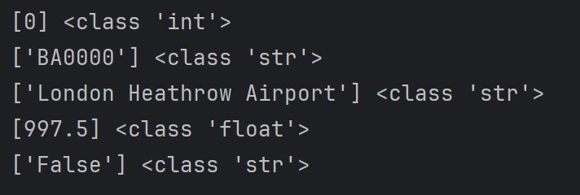 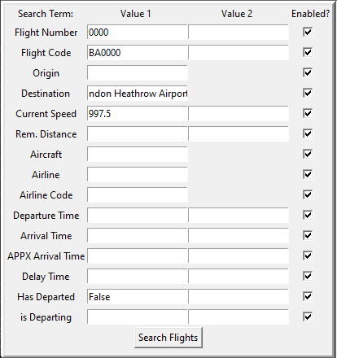                                                       | Shown here are how the user's inputs into the Value 1 section have been converted from their string input formats into the correct type forms.                                                                                                                                                                                                                                                                                                    |                                                                                                                                                                                                     | It is not clear for the user when they have provided an unsuitable input, or if there are simply no flights matching the inputted data. Would be worthwhile implementing a feedback method for the user within the GUI.                                            |
| Range not permitted for strings        |                                                                                                    | Shown here is the omission of Entry fields for a second value to construct a range. Whilst the program can permit ranges between string values, such as "aaa" < chr < "ggg", I believed it to be unsuited to the nature of the flight search.                                                                                                                                                                                                     |                                                                                                                                                                                                     | Technically this feature does persist in the FlightCode input, however, a range was suitable for this entry field as it permitted a range of numerical flight Numbers for a particular airline Code.                                                               |
| Single Value is = check works          |   | Shown here is the program correctly identifying and displaying the only flight with a Flight Number precisely matching 0 or "0000", and hence removing all non matching flights and displaying the matching flight.                                                                                                                                                                                                                               |                                                                                                                                                                                                     | The program only uses the left-hand side inputs when determining if values have been entered to do a single value check. So, an entry of `"0017"` by the user into the right side value box of "Flight Number", will not result in any search term being applied.  |
| Double Value range check works         |   | Shown here is the program correctly identifying and displaying all flights within the inclusive range inputted into the flight number entry fields.                                                                                                                                                                                                                                                                                               |
| Enabled Box works                      |   | Shown here is a comparison of the results of entering a value of 0 as the flight number and attempting to find a match with the enabled box being checked in the first image, and unchecked in the second. As can be seen, when unchecked, the search term is not applied.                                                                                                                                                                        | 
| displayed values refreshed/updated     |   | Shown here is how the flight search will utilise the most recent data stored within the flight object. Whilst the data grid will not automatically update like the Airport Flight Information Grids, it will update and utilise newly updated data when the user presses the "Search Flights" button again.                                                                                                                                       | Searched Flights does not automatically update values. Have not found the cause, however no issues or errors have arisen from this. Not a significant issue, as it can be manually reloaded easily. |                         
| Empty entry values are not applied     |                                                                                                    | Shown here is how the user can leave an entry field blank, and it will not be applied - rather than having to manually edit the enabled box. Shown in the image, all flights are shown as no entry values have been defined. Additionally, in previous testing examples, this feature is further shown combined with search terms having actual values.                                                                                           |
| Multiple values are applied if entered |   | Shown here is how multiple search terms can be applied at once, with flights only being valid if they match all search terms. As shown in the first image, numerous flights from varying airlines matched the given flight number range. However, when the airline Code is applied, the list is reduced to flights matching all data fields.                                                                                                      |


## Testing : Creating New Flights and Airport Management
Shown in multiple of the screenshots below are boxes of colours red or green. These boxes are visual indicators implemented into the program to inform the user if an input is invalid / valid respectively. When the program performs its routine value suitability check every second, or when the value suitability check function is separately called, these boxes are updated accordingly. Hence, they are included in the screenshots to provide visual indicators of the program successfully recognising the attributes as correct/incorrect. Within the program, and their descriptions, these boxes will be referred to as "Value Info Boxes" due to their purpose. 

Should any Value Info Box be displaying as a red value, hence indicating an unsuitable value having been inputted, the function will reject the construction of a new flight or airport, or the destruction of a selected airport.

| Function                                                                  | Evidence                                                                                                                                                                                                                                                                                              | Evidence Description                                                                                                                                                                                                                                                                                                                                                       | Prior Issues (If existed)                                                                                                                                                                                                                                                                                                                                                                                                              | Additional Notes                                                                                                                                                                                                                                                                                                                     |
|:--------------------------------------------------------------------------|:------------------------------------------------------------------------------------------------------------------------------------------------------------------------------------------------------------------------------------------------------------------------------------------------------|:---------------------------------------------------------------------------------------------------------------------------------------------------------------------------------------------------------------------------------------------------------------------------------------------------------------------------------------------------------------------------|:---------------------------------------------------------------------------------------------------------------------------------------------------------------------------------------------------------------------------------------------------------------------------------------------------------------------------------------------------------------------------------------------------------------------------------------|:-------------------------------------------------------------------------------------------------------------------------------------------------------------------------------------------------------------------------------------------------------------------------------------------------------------------------------------|
| Flight Number can only int/0-padded int                                   |                                                                                                     | Shown here are two acceptable forms of input for the flight number. Both are 0-padded integers, with the top being 0 and the bottom being 1 in pure int form. The program successfully recognises the inputs as acceptable, as shown via the green value info boxes to the right.                                                                                          | When constructing the flight, I forgot to ensure that the user entry was converted into 0-padded format, resulting in the user being able to construct flights with fliNum `"17"` rather than `"0017"`  This also resulted in the user being able to create multiple flights with the same flight number, as the flight number checker checked flight codes with a 0-padded user entry. 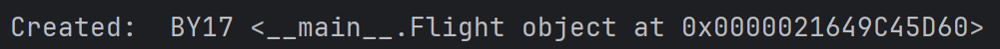 |                                                                                                                                                                                                                                                                                                                                      |
| Flight number rejects length > 4 and negative values                      |                                                                                                     | Shown here are two unacceptable forms of input, the first being a negative value, and the second being a 0-padded value of a length over 4. The program successfully recognises them as invalid through the red value info boxes.                                                                                                                                          |                                                                                                                                                                                                                                                                                                                                                                                                                                        | At its current scale, a potential maximum of 10,000 flights per Airline is far more than sufficient. However, more enhanced versions of this program should look to either increase the maximum size, or use an alternative Flight Number / Code system. Albeit this change is likely very unnecessary for most uses of the program. |
| Origin Airport selection updates with new airports                        |                                                                                                     | Shown here is the optionMenu for selecting the Origin Airport of a new flight being updated whilst the program continues to run. The New addition is "My New Airport" which has been successfully implemented into the optionMenu's dropdown box.                                                                                                                          |                                                                                                                                                                                                                                                                                                                                                                                                                                        |                                                                                                                                                                                                                                                                                                                                      |
| Destination Airport selection updates with new airports                   |                                                                                                     | As previously demonstrated through the Origin Airport selection, the Destination Airport optionMenu is also updated with the new airport "My New Airport" without forcing the program to close and re-run.                                                                                                                                                                 |                                                                                                                                                                                                                                                                                                                                                                                                                                        |                                                                                                                                                                                                                                                                                                                                      |
| Origin and Destination cannot be the same                                 |                                                                                                                                                                                                      | Shown here, the program recognises that the Airport selected for the Origin and Destination is the same, and updates the value info boxes to inform the user that this is an invalid selection.                                                                                                                                                                            |                                                                                                                                                                                                                                                                                                                                                                                                                                        |                                                                                                                                                                                                                                                                                                                                      |
| Origin and Destination cannot be the default prompt                       |                                                                                                                                                                                                      | Shown here, the program also recognises when the Origin and Destination Airport optionMenus have been left as, or set to, their default prompts. This will prevent the creation of a new flight, and the value info box is updated to red accordingly.                                                                                                                     | One issue occured when the optionMenus were updated, and the default value was not set to `"Select Destination" / "Select Origin"` but instead, `"Select Destination Airport" / "Select Origin Airport"`: 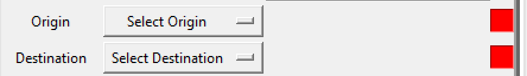 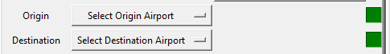 Fixed by ensuring same default prompt used, and altering check method.                                                                                                       |
| Aircraft selection updates after Airline selection                        |                                                                                                     | Shown here is the list of available aircraft for a flight being updated after the airline is changed. The first image shows the user being able to select from the aircraft incorporated in the "Jet2" airline, with the second providing the aircraft belonging to the "British Airways" airline.                                                                         | There is potential for an error in the Flight Construction due to the Menu having no values when an Airline is not selected. The program does not recognise the user selecting the empty option as invalid.  However this is likely to not be a major issue, as the user has to select an airline, which *should* overwrite the users selection of an empty value.                                              |                                                                                                                                                                                                                                                                                                                                      |
| Departute Time can only be time format                                    |                                                                                                     | Shown here are two attempted inputs for the departure time. The first is successfully recognised as a valid time format string of `"HH:MM:SS"`, with the second being invalid, as the values for Hours, Minutes and Seconds are unclear.                                                                                                                                   |                                                                                                                                                                                                                                                                                                                                                                                                                                        | At current, the user can provide any time whatsoever for the flight's departure time. Later iterations of the program may wish to either limit the number of flights that can depart at the same time from an airport, or restrict the flight departure times to be within 15minute windows, eg: `14:30:00`.                         |
| Next Available Flight Number works                                        | 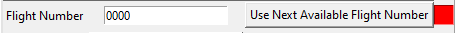  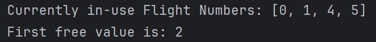                    | Shown here is the user initially providing their own flight number of "0000", which is rejected successfully for already being in use. Upon pressing the "Next Available Flight" button, the program correctly obtains the next lowest free flight number.                                                                                                                 |                                                                                                                                                                                                                                                                                                                                                                                                                                        |                                                                                                                                                                                                                                                                                                                                      |
| Enter Random Data changes all data fields with acceptable values          | 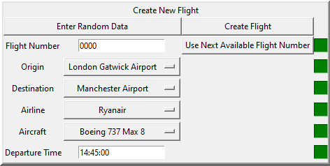 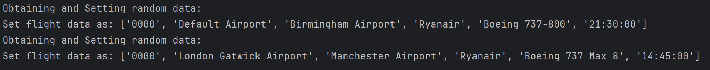                                                                                                                 | Shown here is the program overwriting the previous inputs made into the flight creation values and replacing them with new randomly generated values.                                                                                                                                                                                                                      |                                                                                                                                                                                                                                                                                                                                                                                                                                        |                                                                                                                                                                                                                                                                                                                                      |
| Create Flight works                                                       | 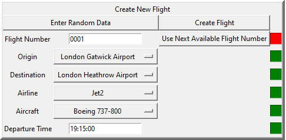 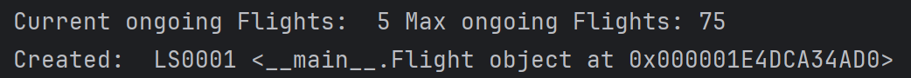                                                                                                                 | Shown here is the program constructing a flight utilising the data inputted into the new flight data entries.                                                                                                                                                                                                                                                              |                                                                                                                                                                                                                                                                                                                                                                                                                                        |                                                                                                                                                                                                                                                                                                                                      |
| Create Flight will impose max flight limit                                | 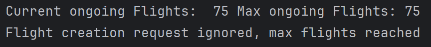                                                                                                                                                                                                            | Shown here is the program repeatedly creating a new flight, and printing the number of ongoing flights next to the max flights. Upon reaching 75 ongoing Flights, which is equal to the current max flights value, the program rejects new flight creation attempts.                                                                                                       |                                                                                                                                                                                                                                                                                                                                                                                                                                        | Max flight limit could be increased from 75 in later editions of the program, as the value is realistically rather low.                                                                                                                                                                                                              |
| Random Batch works                                                        | 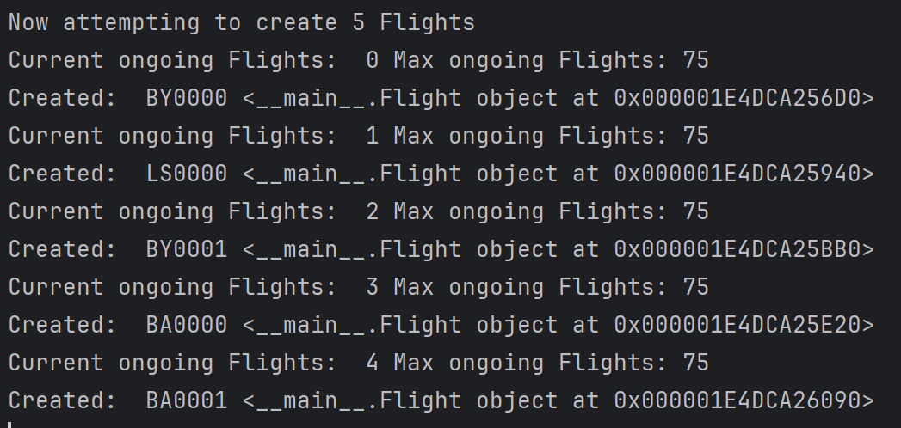                                                                                                                                                                                                                | Shown here is the program correctly interpreting the number of flights to create, and creating them successfully.                                                                                                                                                                                                                                                          |                                                                                                                                                                                                                                                                                                                                                                                                                                        |                                                                                                                                                                                                                                                                                                                                      |
| Random Batch creation will be limited by max flight limit                 | 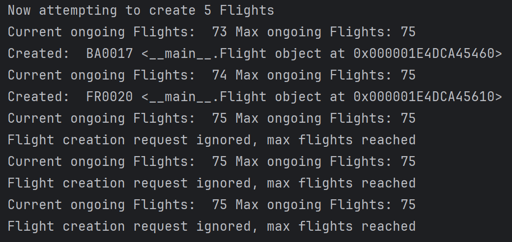                                                                                                                                                                                                            | Shown here is the program rejecting new attempts to create flights via Random Batch Creation due to the max Flights being reached. It is successfull in accepting the construction of flights prior to reaching the limit too.                                                                                                                                             |                                                                                                                                                                                                                                                                                                                                                                                                                                        | Max flight limit could be increased from 75 in later editions of the program, as the value is realistically rather low.                                                                                                                                                                                                              |
| Flight Data Values infoboxes are working                                  |                                                                                                     | As evidenced throughout prior testing of functions, the Value Info Boxes are working as expected, indicating unsuitable and suitable values through red and green. Additionally, it also acts to inform that the program is successfully rejecting/accepting values which shouldnt or should be permitted and has been a useful testing tool for a GUI program.            |                                                                                                                                                                                                                                                                                                                                                                                                                                        |                                                                                                                                                                                                                                                                                                                                      |
| Airport creation name entry must have length > 4 and not be default value |    | Shown here is the program correctly recognising acceptable and unacceptable values for the airport name, with the default prompt and undersized names being rejected. Although it cannot be seen in the image, the input "Four" also includes a series of whitespace characters afterwards, which are also suitably ignored in testing for the length of the airport name. | Airports was not recognising when there was large amounts of whitespace between characters. 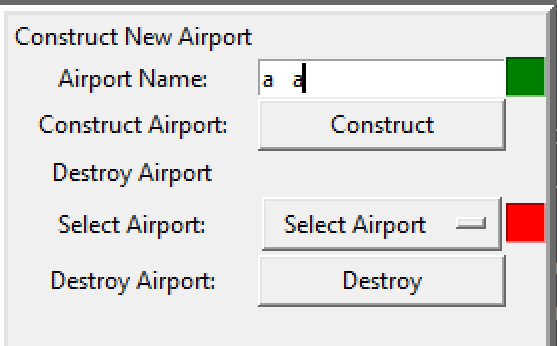 This has since been resolved.                                                                                                                                                                                                                                                                                          |                                                                                                                                                                                                                                                                                                                                      |
| Airport Creation prevents airports having the same name                   |    | Shown here in these images, Default Airport is an already existing airport. When the user attempts to input any variation of "Default" or "Default Airport"                                                                                                                                                                                                                | Originally did not have program converting inputs without "Airport", such as "Default" being tested as "Default Airport", when checking if an airport name was already taken. This resulted in the user being able to create airports with the same name.                                                                                                                                                                              |                                                                                                                                                                                                                                                                                                                                      |
| Airport Destroy updates with new airports                                 |                                                                                                     | Shown here in these images, a new airport called "Example Airport" has been added to the list of available airports to be destroyed.                                                                                                                                                                                                                                       |                                                                                                                                                                                                                                                                                                                                                                                                                                        |                                                                                                                                                                                                                                                                                                                                      |
| Airport Destroy Works                                                     |                                                                                                                                                                                                      | Shown here is the list of current airports in the program updating, as "East Midlands Airport" is removed.                                                                                                                                                                                                                                                                 |                                                                                                                                                                                                                                                                                                                                                                                                                                        |                                                                                                                                                                                                                                                                                                                                      |
| Airport Destroy options are updated after airport destroyed               |                                                                                                     | Shown here is the airport Destroy options successfully updating to match the current list of airports, after having one be destroyed.                                                                                                                                                                                                                                      |                                                                                                                                                                                                                                                                                                                                                                                                                                        |                                                                                                                                                                                                                                                                                                                                      |
| Airport Destroy fails if airport has inbound/outbound flights             |                                                                                                     | Shown here is the airport destroy function rejecting the user's command for deleting an airport, as the airport currently has either inbound or outbound flights travelling to or from it.                                                                                                                                                                                 |                                                                                                                                                                                                                                                                                                                                                                                                                                        | Could be beneficial to provide the user with the ability to make a delayed deletion request, whereby once all inbound and outbound flights for the selected airport have finished their journeys, the airport can then be deleted automatically, wtihout the user having to wait until the flights are empty themselves.             |
| Airport Creation and Destruction infoboxes work                           |                                                                                                                                                                                                      | Shown here, and as has been evidenced in prior examples, the infoboxes are correctly functioning to inform the user of valid/invalid inputs.                                                                                                                                                                                                                               |                                                                                                                                                                                                                                                                                                                                                                                                                                        |                                                                                                                                                                                                                                                                                                                                      |

## Testing : The Flight Class and the stored Data
| Function                                                              | Evidence                                                                                                                                                                                                                                                                                              | Evidence Description                                                                                                                                                                                                                                                                        | Prior Issues (If existed)                                                                                                                                                                                                                                                                     | Additional Notes                                                                                                                                                                                                                                                       |
|:----------------------------------------------------------------------|:------------------------------------------------------------------------------------------------------------------------------------------------------------------------------------------------------------------------------------------------------------------------------------------------------|:--------------------------------------------------------------------------------------------------------------------------------------------------------------------------------------------------------------------------------------------------------------------------------------------|:----------------------------------------------------------------------------------------------------------------------------------------------------------------------------------------------------------------------------------------------------------------------------------------------|:-----------------------------------------------------------------------------------------------------------------------------------------------------------------------------------------------------------------------------------------------------------------------|
| Flight correctly stores values with the right data type               |                                                                                                                                                                                                      | Shown here is a section of code from the Flight Class, demonstrating that parameters are set to their correct data type upon construction of a new flight object.                                                                                                                           |                                                                                                                                                                                                                                                                                               |                                                                                                                                                                                                                                                                        |
| Data types are converted successully where needed                     |                                                                                                                                                                                                      | Shown here is the program retrieving the flight's `fliNum` data, and converting it from it's 0-padded string format to a pure int format.                                                                                                                                                   |                                                                                                                                                                                                                                                                                               |                                                                                                                                                                                                                                                                        |
| Flight only "starts flying" whilst program time within flight window  |                                                                                                     | The top image displays the flight changing from a non-flying status into a flying status once the time changes to `06:11:00`, this permits the flight to start "Flying".                                                                                                                    | Numerous issues arose with arranging the flight window, typically as a result from the 24 hour wrap around of program time causing the Arrival Time to potentially be less than the Departure Time. These issues are since resolved, but remained difficult.                                  | Issues encountered with managing flight timetabling and determining flight window suggests that the 24 hour wrap around time was a sub-optimal method. Potentially alter the program time to utilise a measure of days from 0 instead for greater ease of timetabling. |
| Flight values updated according to change in time                     |                                                                                                                                                                                                      | Shown here are 3 different values of timeMultiplier successfully affecting the change in time, and thus the amount by which the remaining distance is updated. The base 1-second travel distance is included for a comparison.                                                              |                                                                                                                                                                                                                                                                                               |                                                                                                                                                                                                                                                                        |
| Delay can be caused from slower flight speed than expected            |                                                                                                     | The top image displays the flight speed, remaining distance and Aircraft respectively. The image beneath shows the Timetabled DepartureTime, Timetabled ArrivalTime, True ArrivalTime and DelayTime. As shown, the lower flight speed has resulted in the flight being delayed.             | Errors initially arose due to how timetabling was managed, with all flights timetabled arrival time being in the 15minute window that the true arrival time landed in, it produced negative delay when comparing the two factors. This was resolved by changing negative delay to `00:00:00`. | Delay is currently very random, and minimal. Would be worth deriving a new method for flight delays, such as delayed departures, or even weather patterns affecting multiple flights in an area for futer iterations of the program.                                   |
| Flight will halt updating values at distance of 0                     |                                                                                                                                                                                                      | Shown here is the flight Updating the remaining distance, with the actual remaining distance prior to Updating being displayed after. Since the remaining distance was less than the travelled distance, the program correctly assigns the flight as Landed, and stops updating the values. |                                                                                                                                                                                                                                                                                               |                                                                                                                                                                                                                                                                        |
| Flight is contained / moved to relevant inbound/outbound/landed list  |    | Shown here is a flight arriving at it's destination, and the program correctly changing the list it is stored in. The top two images display the flight being displayed in a different section within the program, and the second printing the full lists of flightCodes.                   |                                                                                                                                                                                                                                                                                               |                                                                                                                                                                                                                                                                        |
| Landed flights do not attempt to depart again                         |                                                                                                     | Shown here is an excerpt of the code showing how the first operation of the Flight Update function is to return should the flight have already landed. This successfully prevents the flight from departing again once the programTime returns to within the flight window.                 |                                                                                                                                                                                                                                                                                               |                                                                                                                                                                                                                                                                        |
| Landed flights are removed from allFlights list to free up maxFlights |                                                                                                                                                                                                      | Shown here is a series of flights landing, and the current number of remaining ongoing flights being outputted. The user adds a new set of flights, bringing the list up to the maximum of 75, which then updates again when more flights land.                                             |                                                                                                                                                                                                                                                                                               |                                                                                                                                                                                                                                                                        |

## Testing : The Graphical User Interface, ProgramTime, and Other Elements
| Function                                                               | Evidence                                                                                                                                                                                                                                                                                              | Evidence Description                                                                                                                                                                                                                                             | Prior Issues (If existed)                                                                                                                                                                                                                                                                                                      | Additional Notes                                                                                                                                                                           |
|:-----------------------------------------------------------------------|:------------------------------------------------------------------------------------------------------------------------------------------------------------------------------------------------------------------------------------------------------------------------------------------------------|:-----------------------------------------------------------------------------------------------------------------------------------------------------------------------------------------------------------------------------------------------------------------|:-------------------------------------------------------------------------------------------------------------------------------------------------------------------------------------------------------------------------------------------------------------------------------------------------------------------------------|:-------------------------------------------------------------------------------------------------------------------------------------------------------------------------------------------|
| Tkinter window interface                                               |                                                                                                                                                                                                      | Shown here is the window initially presented to the user when the program is ran.                                                                                                                                                                                |                                                                                                                                                                                                                                                                                                                                |                                                                                                                                                                                            |
| Switching screens via the menubar                                      |    | Shown here is the user clicking upon the "Search Flights" menu button, highlighted in light grey in the central image, and causing the program to switch the displayed screen, as shown in the bottom image.                                                     | Unknown issues arose when originally producing the second screen "Search Flights", whereby upon switching screens Widgets would not load untill the menubar button for the "Search Flights" screen was pressed again. The issue was at some point unknowingly resolved, but originated from an unknown cause.                  |                                                                                                                                                                                            |
| Scrollbar functionality in flight data grids working                   |    | Shown here is the user moving the scrollbars on the Canvas, producing 3 examples. The top image is the unaltered view, the middle has the user scrolling to the Right, and the bottom has the user scrolling to the bottom right.                                |                                                                                                                                                                                                                                                                                                                                |                                                                                                                                                                                            |
| ProgramTime updates at set rate                                        |                                                                                                                                                                                                      | Shown here is the program time successfully updating and applying the timeMultiplier seconds to its value.                                                                                                                                                       | Initially UpdateProgramTime would utilise `self.root.after(1000/timeMultiplier)` to produce a loop. However, this limited the timeMultiplier to between 1 and 1000, as any less would result in an undefined or float value which would not be accepted. Additionally, running the loop 1000 times per second was inefficient. | Users could find it beneficial to be able to set the Program Time to a specific value, rather than having to wait the time.                                                                |
| ProgramTime correctly wraps at 24:00:00 mark                           |                                                                                                                                                                                                      | Shown here is the program time successfully wrapping back to `00:00:00` once reaching `24:00:00`, with the time incrementing by 10 seconds each time.                                                                                                            |                                                                                                                                                                                                                                                                                                                                | As mentioned in a previous notes section, it is worth investigating if incorporating a days value into prorgamTime would make timetabling easier - rather than resetting back to 00:00:00. |
| TimeMultiplier input rejects non-ints, non-positive and oversized ints |    | Shown here is the timeMultiplier obtaining the user's input (the second line in each text block) and determining if it is a valid input. "a", "999999999999" and "-1" are successfully converted to acceptable default values.                                   |                                                                                                                                                                                                                                                                                                                                |                                                                                                                                                                                            |
| ProgramTime and TimeMultiplier display updates each second             |                                                                                                     | Shown here is an except of the code performing the Program Update Loop, with `1000ms` being equivalent to 1 second. Below is the program time updating every real-time second as a result of this.                                                               |                                                                                                                                                                                                                                                                                                                                |                                                                                                                                                                                            |
| ProgramTime display is non-editable by user                            |                                                                                                     | Shown here is the user attempting to edit or remove the value in the display, however, the only thing the user can do is highlight the text in the display (top image) - hence the program has succeeded in preventing unwanted user modifications.              |                                                                                                                                                                                                                                                                                                                                |                                                                                                                                                                                            |
| Flight Data Grids are non-editable by user                             |                                                                                                     | Shown here is a recreation of the user's attempts to edit the Program Time display, except with the flight data grid instead. Each cell is successfully disabled for configuration and editing by the user.                                                      |                                                                                                                                                                                                                                                                                                                                |                                                                                                                                                                                            |
| Displayed data is rounded to no more than 2dp                          |                                                                                                     | Shown here is a display of two flights' remaining distances, and the actual unrounded values displayed in the image beneath, demonstrating that the program has successfully rounded the display values whilst retaining the true accuracy in the flight's data. |                                                                                                                                                                                                                                                                                                                                | Potentially permit the user to assign the level of specificity / digits when rounding values.                                                                                              |

## Testing : Program File Management - Starting and Ending procedures

| Function                                                                 | Evidence                                                                                                                                                                                                                                                                                              | Evidence Description                                                                                                                                                                                                                   | Prior Issues (If existed) | Additional Notes                                                                                                                                                                                                                                                                               |
|:-------------------------------------------------------------------------|:------------------------------------------------------------------------------------------------------------------------------------------------------------------------------------------------------------------------------------------------------------------------------------------------------|:---------------------------------------------------------------------------------------------------------------------------------------------------------------------------------------------------------------------------------------|:--------------------------|:-----------------------------------------------------------------------------------------------------------------------------------------------------------------------------------------------------------------------------------------------------------------------------------------------|
| Files checked to see if they exist, can be opened and read successfully  |    | Shown here is the program printing each line in both, the `AirportsAirlines.txt` and `ongoingFlights.txt` files. Hence, the files can be accessed and read.                                                                            |
| If files are unfound, they are created with default data                 |    | The first image shows the program recognising that the files do not exist within the local space, and hence creating them with default data. The bottom two images show the files created, with the default data inserted into them    |                           | Rather minimal airlines default data suggests the ability for the user to add more airlines and airline data themselves in future iterations of the program                                                                                                                                    |
| ProgramTime is read correctly and stored as `datetime.timedelta` object  |                                                                                                                                                                                                      | Shown here is the results as the program reads the programTime data from the file, and converts it from a string into a datetime.datetime object, and then into a datetime.timedelta object.                                           |                           |
| String Flight Data Values is read correctly and stored as separated list |                                                                                                                                                                                                      | Shown here is the program correctly reading the line of flight data stored in the file, and then splitting it into a list of string values.                                                                                            |
| File data for flights is read and used to construct flights              | 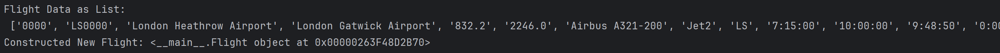                                                                                                                                                                                                                                  | Shown here is the program successfully constructing a new flight object from data read from the file.                                                                                                                                  |
| Airport Names read correctly and stored                                  | 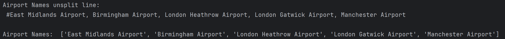                                                                                                                                                                                                                                | Shown here is the program reading the Airport Names line, and splitting the names into a list.                                                                                                                                         |
| Airports constructed using read Airport Names                            | 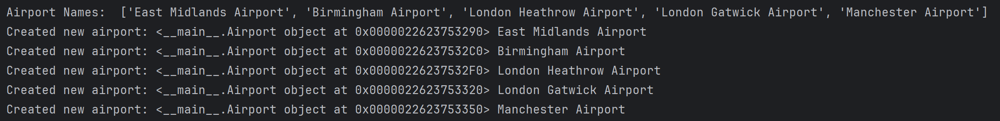                                                                                                                                                                                                                                | Shown here is the program iterating through a list of Airport names, and using them to construct a new airport with each name.                                                                                                         |
| Airline Data read successfully and stored                                | 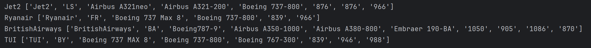                                                                                                                                                                                                                            | Here the program correctly reads each line of program data in the file, and stores each line as a split list of data.                                                                                                                  |
| User attempts to close program, request for confirmation is displayed    | 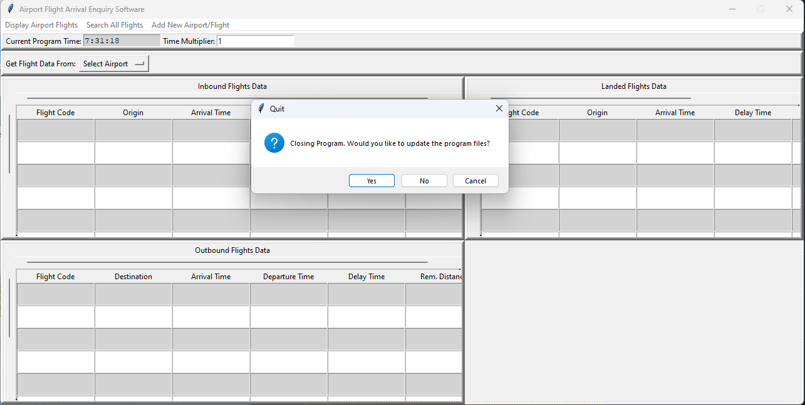                                                                                                                                                                                                                            | Here the program recognises that the user has attempted to close the program (through pressing the close button on the top right) and has provided a prompt for the user to either save, not save, or cancel when exiting the program. |
| User attempts to close program, options Y/N/Cancel Working               | 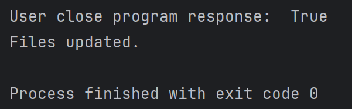 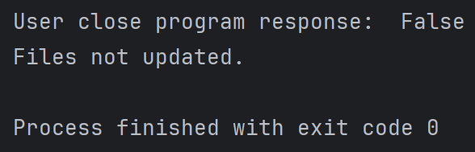 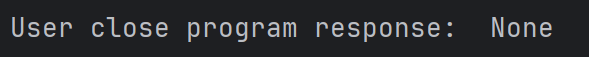                                                                      | The images shown display the potential results depending on the user's selection of what to do when closing the program.                                                                                                               |
| On Save Exit, file updated with all ongoing flights (Have not landed)    | 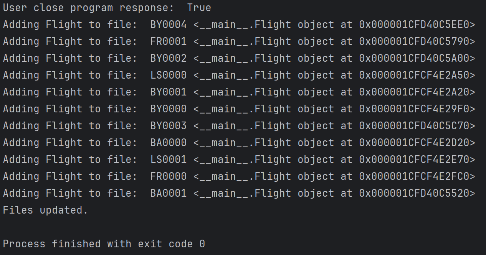 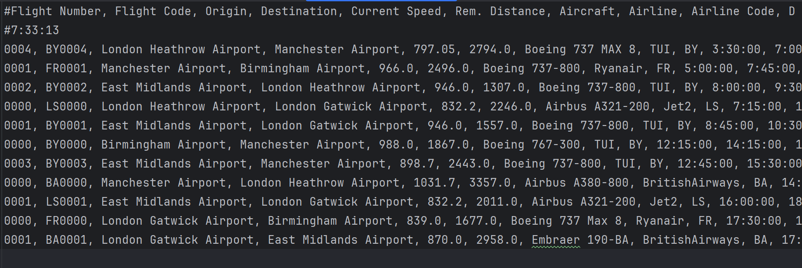                                                                                                                                             | The program successfully adds all current ongoing flights to the file. Landed flights are omitted.                                                                                                                                     |
| flights are saved in order of arrival                                    | 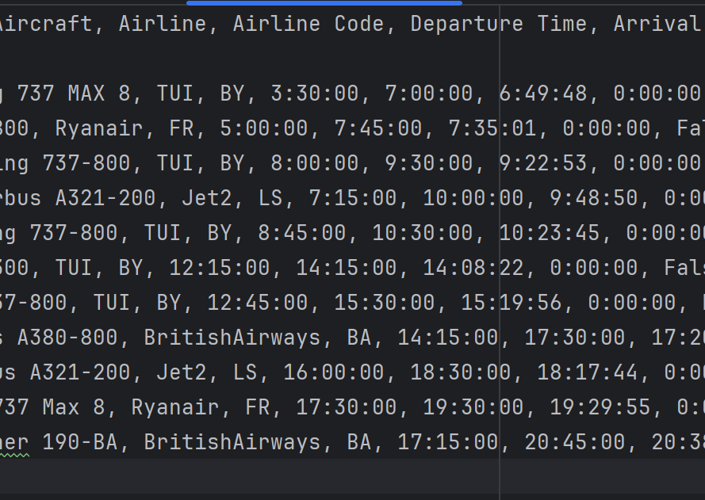                                                                                                                                                                                                                          | Here the file shows that the flights have been written in arrival order, with the second time value (format of `00:00:00`) being the arrival time - starting with `7:45:00`.                                                           |                           | Whilst the flights are ordered by arrival time, due to the time wrapping of program time, their order may not necessarily be fully correct, as with a programTime of `7:40:00`, flights due to arrive at `01:15:00` would not arrive before the flight at `08:00:00` provided it is in flight. |
| Saved data is correctly formatted to be read upon opening program again  | 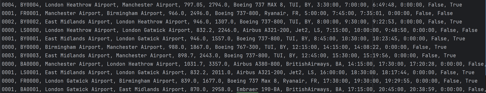                                                                                                                                                                                                                          | The data stored within the file is formatted correctly.                                                                                                                                                                                |
| ProgramTime is updated in file                                           | 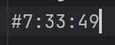 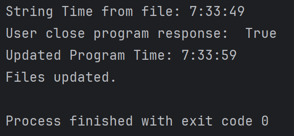                                                                 | Shown here is the program time being successfully updated and stored in the correct format within the file after waiting for 10 seconds.                                                                                               |
| Airport Names list is updated in file                                    | 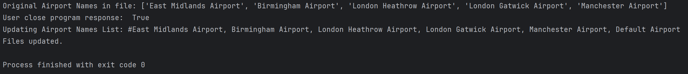 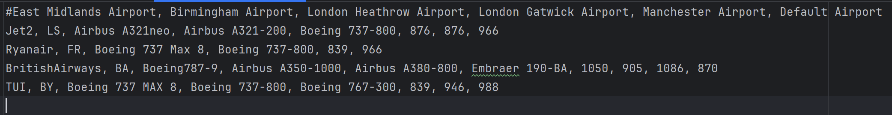                                                                                                                                             | The file successfully updates and formats the airport names in the file, to account for any new additions or removals of airports.                                                                                                     |

# Section : Overview with Further Improvements and Additions
The improvements and additions can be summarised within 3 primary categories, these being the following:

- Optimisation and Efficiency
- Short Term Development Goals
- Long Term Development Goals

As an overall perspective, however, I believe that a focus upon incorporating more realistic elements into the program, alongside bettering the user experience in some areas, would be beneficial to the feel and potential utilisation of the program.
## Optimisation and Efficiency:
This would cover improvements to the overall performance of the program with the GUI and updating of values. Currently, when flight values in a display are updated, the entire data grid is updated - all rows of data are removed, only for data to then be re-inserted into the data cells. This method is particularly inefficient when only a few data values are being updated each time.

As a result of this, it would be worthwhile investigating new methods of updating the data grids and performing calculations with Flight data, in order to better the efficiency of the program. This would permit the user to easily utilise more than 75 ongoing flights, or more than 25 rows within the data grids.

As a lead from which development may continue, the `ConstructDynamicDataGrid` function within `Main` may be better being removed. Instead, the data grids would be constructed through their own class, with its relevant functions to access and edit specific cells, rows or columns.

## Short Term Development Goals
These goals would cover improvements and additions that can be done relatively rapidly and easily, as they have minimal impact on the overall structure of the program.

One example would be providing positional values to the Airports when they are constructed, and hence storing the values in the `AirportsAirlines.txt` file. Currently, the flight Distance between any two given airports is a random integer value, which means that even flights between the same airports are unlikely to have the same flight distance. Through incorporating a position within the Airport class, a consistent flight distance can be obtained for the flights to travel across, pushing the program towards greater realism. 

Another would be better user experience when searching flights. Currently the user is unaware if the search terms entered are potentially unsuitable, or if there are simply no flights that match the data. Due to this, it would be beneficial to incorporate the system included within the New Flight Creation and Airport Management screen, with the red/green infoboxes. These can inform the user when they have provided valid inputs that can be inferred, and hence indicate when there are simply no flights due to unsuitable search terms. In addtion to this, the Searching Flight screen may also benefit from recognising single-value entries in Value Entry 2, rather than only reading from Value Entry 1.

With regards to the program time, it would be beneficial for the user to be able to precisely set the program time value, rather than being forced to wait out the time, or attempt to manipulate the timeMultiplier value in an attempt to reach the desired programTime quicker. Ultimately this would not be a smooth user experience, and the additional benefits setting program time brings for ease of testing makes this a very useful improvement. 

Flight delays would also be enhanced by introducing a situation where a flight's departure time is delayed, rather than every flight starting their update routine precisely when program time enters the flight window. This would add greater realism, rather than only having some flights being chosen at random to fly slower. 

As a final suggestion for improvement, the user would be able to construct (and hence remove) Airlines and respective Airline Data. I believe providing the user with more freedom and utility would be beneficial to the user experience, alongside improving the currently limited selection of only 4 airlines.

## Long Term Development Goals
These goals would cover large-scale improvements, reworks or major additions to the program that could fundamentally change elements of the program, alongside taking a lengthier time to develop.

The first and relatively easiest development involves `tk.OptionMenu()` and the flawed use of `tk._setit()` to assign new Menu options to the dropdown menu. Due to being the private function of the tk object, there is the potential for changes to be applied to the function. A recommended alternative would be replacing the OptionMenus within the program for `ttk.Combobox` widgets, which would permit this feature. Whilst I believe the functionality of `tk._setit` is unlikely to change, for the purposes of good practise, alongside future-proofing of the program, it would be suitable to change the usage of the optionMenus. 

This development was informed via https://stackoverflow.com/questions/73504540/should-i-use-setit-even-if-i-get-a-warning-tkinter [Accessed: 7th December 2023]. 

The next development would be to alter how programTime is managed within the program. Currently, programTime utilises a 24 hour clock, and wraps back to `00:00:00` at `24:00:00`. This produces a simple day cycle, which initially served the program particularly well. However, when it came to programming around flights departing before and arriving after `24:00:00`, difficulties began to appear due to the wrap around. There is potential that utilising a days value could result in programTime being more manageable for cross-day flights. However, what then must be considered is the events as days increases into years, and so forth. At the current maximum rate of timeMultiplier (6 hours per real-time second), a day only lasts 4 seconds, and as such the user could potentially amass numerous years of time relatively rapidly. Alongside this, should the short term goal of the user being able to set a specific programTime be applied, the program should account for a days value to be entered also.

The most significant development would be implementing positional information for flights and aircraft. This would permit aircraft and airports to be mapped, with the program able to monitor the location of aircraft as they travel, applying weather affects upon flight speed, and retaining a consistent distance between airports. It would require additional data being stored for Flights and Airports, alongside permitting the user to assign positional data to any new Airports that they create. However, once positional data is given, then there is the potential for the GUI aspect of the program to be enhanced through the use of pygame to provide visuals of flights travelling between Airports, and the weather patterns afflicting them. When searching for flights, the pygame window may also be configured to follow by the search terms, such that only flights which match the search terms are both displayed in the data grid, alongside displayed visually in pygame. Through the introduction of a major visual-based aspect of the program, the flights are more understandable to the user than purely data. Additionally, it lends itself towards increasing realism of the program, through utilising flight paths between Airports and weather effects. Ultimately, I believe that the introduction of visuals-based aspects through either pyame or another similar method would be massively beneficial to the program in its ability to increase the potential for realism and user experiences.

# Conclusion
In conclusion, the FlightArrivalEnquiry program, as it currently stands, is a project that has numerous foundations being constructed from which a large-scale program could easily be built from. Whilst some aspects of the current program should undergo review, such as the use of OptionMenus and the current programTime methods, overall the current project is stable.

Successful development - in my opinion - likely hinges upon bettering the user experience in some areas, and furthering the realistic aspects of the project to be more than a simple data observation and management tool.

# Website Links and References
Throughout the README document and project, various links to websites have been incorporated, and they are listed again here as an additional summative list (image links omitted), alongside others also included for the research and creation of the project.

### README.md Links:
- Python 3.12 documentation: https://www.python.org/downloads/release/python-3120/ [Accessed: 3rd Deccember 2023]
- Tkinter library: https://docs.python.org/3/library/tkinter.html [Accessed: 3rd Deccember 2023]
- The `open()` function: https://docs.python.org/3/library/functions.html#open [Accessed: 3rd Deccember 2023]
- Using datetime.timedelta objects: https://docs.python.org/3/library/datetime.htm#timedelta-objects [Accessed: 3rd Deccember 2023]
- The `tk._setit` warning https://stackoverflow.com/questions/73504540/should-i-use-setit-even-if-i-get-a-warning-tkinterhttp [Accessed: 7th Deccember 2023]

### Program Code Links (referenced in-program when used):
- Using canvases to create scrollable frames: https://stackoverflow.com/a/3092341 [Accessed: 14th November 2023]
- Updating OptionMenu options: https://stackoverflow.com/a/17581364 [Accessed: 14th November 2023]

### Sources for airlines data:
British Airways airline data Links:
- Aircraft Models in use: https://www.britishairways.com/content/information/about-ba/fleet-facts [Accessed: 11th November 2023]
- Airline Code (BA): https://www.planespotters.net/airline/British-Airways [Accessed: 8th December 2023] from the IATA airline code.
- Aircraft (Boeing 737-9) Speeds: https://simpleflying.com/could-the-boeing-787-dreamliner-fly-at-supersonic-speeds/ [Accessed: 11th November 2023] from which the (non-max) cruise speed was used.
- Aircraft (Airbus A350-1000) Speeds: https://www.airlines-inform.com/commercial-aircraft/airbus-a350-1000.html [Accessed: 11th November 2023] from which the (non-max) cruise speed was used
- Aircraft (Airbus A380-800) Speeds: https://skybrary.aero/aircraft/a388 [Accessed: 11th November 2023] from which the max cruise speed was used.
- Aircraft (Embraer 190-BA) Speeds: https://www.aerospace-technology.com/projects/embraer_190/ [Accessed: 11th November 2023] from which the cruise speed was used (sixth image text)

Jet2 airline data Links:
- Aircraft Models in use: https://www.planespotters.net/airline/Jet2 [Accessed: 11th November 2023]
- Airline Code (LS): https://www.planespotters.net/airline/Jet2 [Accessed: 11th November 2023] from the IATA airline code.
- Aircraft (A321neo, A321-200) Speeds: https://en.wikipedia.org/wiki/Airbus_A321 [Accessed: 11th November 2023] from which the max speed value was used.
- Aircraft (Boeing 737-800) Speeds: https://www.rocketroute.com/aircraft/boeing-737-800 [Accessed: 11th November 2023] from which max speed was used.

TUI airline data Links:
- Aircraft Models in use: https://www.tui.co.uk/flight/flying-with-us/our-fleet [Accessed: 11th November 2023]
- Airline Code (BY): https://www.planespotters.net/airline/TUI-Airways [Accessed: 8th December 2023]
- Aircraft (Boeing 737-800) Speeds: https://www.rocketroute.com/aircraft/boeing-737-800 [Accessed: 11th November 2023] from which max speed was used.
- Aircraft (Boeing 737 MAX 8) Speeds: https://www.icelandair.com/about/our-fleet/boeing-737-max/ [Accessed: 11th November 2023] from which the max cruise speed was used.
- Aircraft (Boeing 767-300) Speeds: https://www.skybrary.aero/aircraft/b763 [Accessed: 11th November 2023] from which the Cruise speed was used.

Ryanair airline data Links:
- Aircraft Models in use: https://www.airfleets.net/flottecie/Ryanair.htm [Accessed: 11th November 2023]
- Airline Code (FR): https://www.airfleets.net/flottecie/Ryanair.htm [Accessed: 11th November 2023]
- Aircraft (Boeing 737 MAX 8) Speeds: https://www.icelandair.com/about/our-fleet/boeing-737-max/ [Accessed: 11th November 2023] from which the max cruise speed was used.
- Aircraft (Boeing 737-800) Speeds: https://www.rocketroute.com/aircraft/boeing-737-800 [Accessed: 11th November 2023] from which max speed was used.


